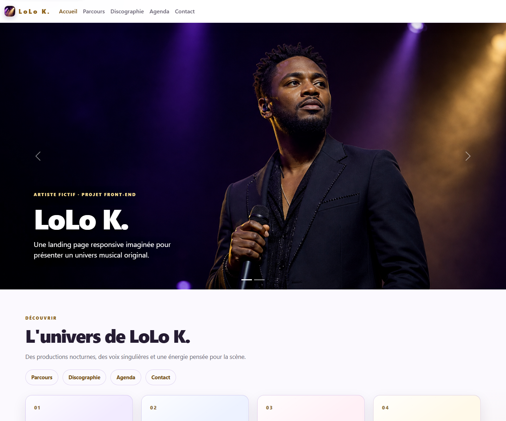
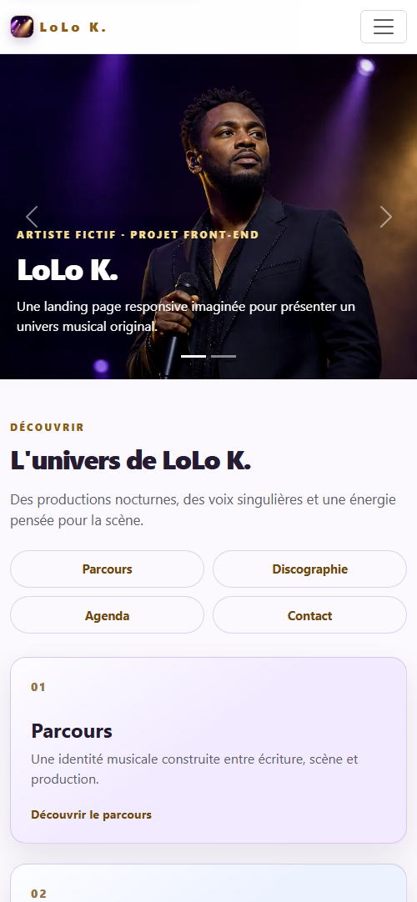

# LoLo K. — landing page portfolio

> Landing page musicale responsive imaginée pour **LoLo K.**, artiste fictif. Projet réalisé pour démontrer la conception d'une expérience front-end complète, accessible et adaptée à tous les écrans.

## Aperçu

### Vue desktop

  

### Vue mobile

  

## Démo publique

Le projet est prêt pour un déploiement sur GitHub Pages grâce au workflow présent dans [`.github/workflows/deploy-pages.yml`](.github/workflows/deploy-pages.yml).

> Statut : à publier. Le lien de démonstration sera ajouté ici uniquement après vérification de la version publique de LoLo K.

## Objectif du projet

Concevoir une landing page d'artiste fictif qui raconte un univers musical, présente une discographie, un agenda et une prise de contact, sans dépendre d'un framework JavaScript.

## Mon rôle

J'ai assuré la conception et l'intégration du projet, de l'identité visuelle au parcours de contact.

- Conception de l'identité visuelle et de la structure éditoriale.
- Intégration HTML/CSS et adaptation responsive avec Bootstrap.
- Développement de la navigation par ancres, du menu mobile et des états actifs au défilement.
- Mise en place de la validation de formulaire et de l'envoi asynchrone via EmailJS.
- Création et intégration de visuels originaux pour l'univers de LoLo K.

## Fonctionnalités

- Navigation mono-page fluide vers Accueil, Parcours, Discographie, Agenda et Contact.
- Carrousel contrôlé par l'utilisateur.
- Grilles responsive pour les projets musicaux et les dates de tournée.
- Agenda avec six dates fictives et boutons de demande de réservation qui préremplissent l'événement choisi dans le formulaire.
- Formulaire de contact fonctionnel avec accusé de réception automatique, gestion d'erreur et envoi via EmailJS.
- Formulaire avec validation des champs requis.
- Lien « Aller au contenu principal » pour la navigation clavier.
- Prise en compte de la préférence de réduction des animations.

## Choix techniques

- **HTML5 sémantique** : `header`, `main`, `section`, `article`, `aside`, `time` et libellés de formulaire.
- **CSS3** : variables de thème, `clamp()`, grilles flexibles, breakpoints et mode clair.
- **Bootstrap 5.3.2** : grille, navbar responsive, carrousel et retours de validation.
- **JavaScript vanilla** : fermeture du menu mobile, lien de navigation actif, validation et envoi asynchrone du formulaire.
- **Performance** : dimensions d'images définies, chargement différé des visuels secondaires et préchargement du hero.

## Qualité et vérifications

- Capture desktop réelle réalisée à une largeur de 1440 px.
- Vérification statique des ancres de navigation, des assets locaux et de l'absence d'anciennes références AC/DC/Gims.
- Styles responsive prévus pour les seuils 992 px, 768 px et 576 px.
- Vérifications d'accessibilité : langue du document, alternatives d'images, hiérarchie de titres, focus clavier, labels associés aux champs et réduction des animations.

> Les scores Lighthouse seront ajoutés après un audit effectué sur l'URL publique, car ils dépendent du serveur et du réseau réels. Aucun score n'est affiché avant cette mesure.

## Lancer le projet localement

Ouvrir `index.html` avec un serveur local, par exemple l'extension Live Server de VS Code. Aucune installation de dépendance n'est nécessaire.

## Limites connues

Le formulaire est relié à EmailJS pour l'envoi des demandes et un accusé de réception automatique au visiteur. Les données saisies sont transmises via EmailJS et Gmail uniquement pour traiter la demande. Il ne constitue pas une billetterie : aucune réservation de place ni aucun paiement ne sont gérés par le site.

Les textes, les projets musicaux, les dates de tournée et l'artiste LoLo K. sont fictifs. Les visuels ont été créés pour ce projet et ne représentent aucune personnalité réelle.
